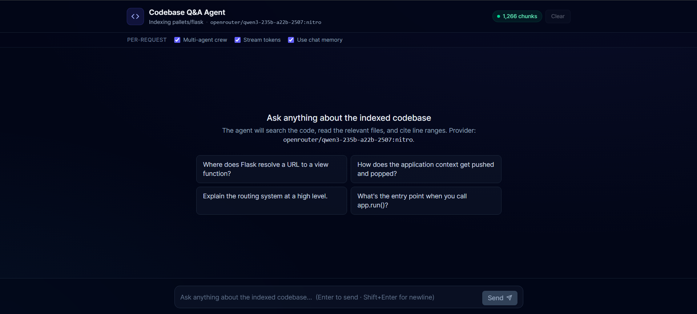
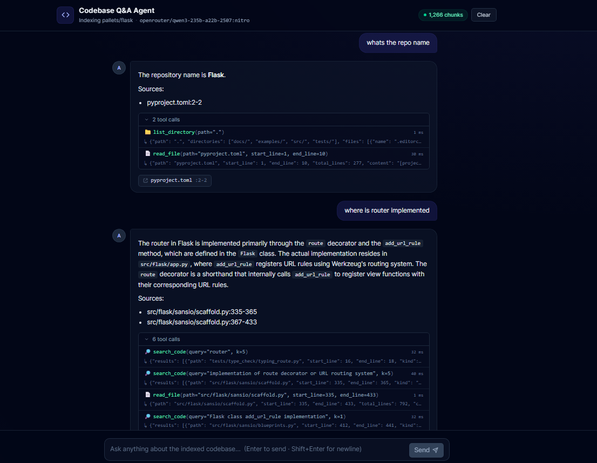
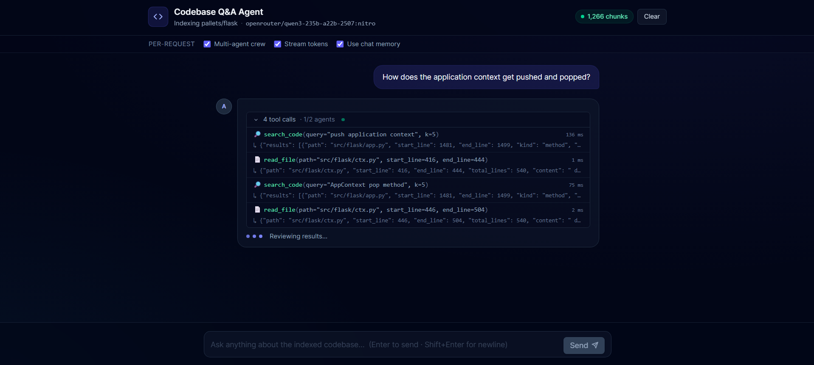
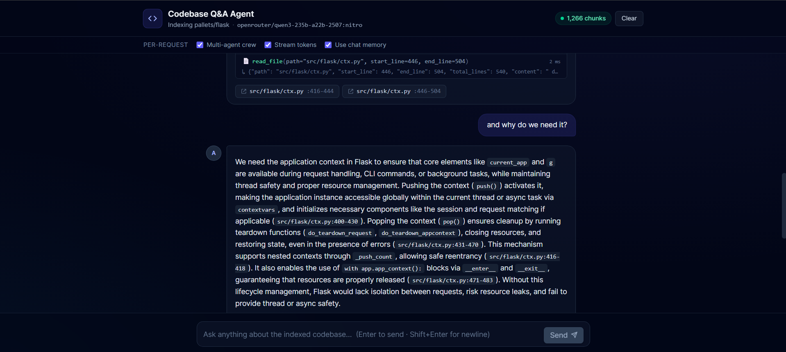

# Codebase Q&A Agent

> An agentic Q&A system that answers natural-language questions about a public
> Python codebase ([pallets/flask](https://github.com/pallets/flask) by default),
> grounded in retrieval-augmented generation, AST-aware code chunking, and a
> tool-using agent that cites its sources.

Built for the Ajentica technical assessment. Implements all core requirements
**plus all four bonus features** (multi-agent crew, reasoning trace, SSE
streaming, in-memory chat context), each behind its own feature flag.

---

## Demo

> **Watch the demo video:** [https://youtu.be/YtVyC5kCcm0](https://youtu.be/YtVyC5kCcm0)

---

## What it does

Ask the agent a question about Flask — it figures out which of its four tools
to use, reads the actual source, and returns an answer with **`path:start-end`
citations** that link straight to the line range on GitHub.

Sample interaction (real output, qwen-3 235b via OpenRouter):

> **Q:** *Where does Flask resolve a URL to a view function?*
>
> Flask resolves a URL to a view function in two main steps:
> 1. **URL Matching:** `AppContext.match_request` uses `url_adapter.match()`
>    to map the request URL to a `url_rule`, storing the rule and view args
>    on the request.
> 2. **Dispatching:** `Flask.dispatch_request` looks up `view_functions[rule.endpoint]`
>    and calls it with the matched `view_args`.
>
> *Sources:*
> - `src/flask/ctx.py:405-414`
> - `src/flask/app.py:966-990`

If the question is out-of-scope or the index has no relevant evidence, the
agent **refuses gracefully** rather than hallucinate:

> *"I could not find evidence in the indexed Flask codebase about Django ORM internals."*
> *Sources: none.*

---

## Chosen repository

**[pallets/flask](https://github.com/pallets/flask)** (main branch). After
ingest:

- **191 files indexed** (Python source + .rst/.md/.toml/.cfg)
- **1266 AST-aware chunks** in ChromaDB
- **~54 seconds** end-to-end ingest on a Windows laptop, sentence-transformers `all-MiniLM-L6-v2` for embeddings
- Binary files, `__pycache__`, `.git`, `node_modules`, etc. skipped

---

## Architecture

```
React + Tailwind UI                 FastAPI                 Agent layer
─────────────────────              ──────────              ───────────────────────────────
                                                             ┌─ Single agent (core) ──┐
  Composer ──▶ /api/chat ──────▶  ChatRequest ──▶  picks ──▶│                         │
            or /api/chat/stream                              ├─ 4-agent Crew (bonus) ──┤
                                                             │  Planner → Researcher   │
                                          tools per request: │  → Module Expert        │
                                          [search_code,      │  → Synthesizer          │
                                           read_file,        └────────────┬────────────┘
                                           list_directory,                │ tool calls
                                           summarize_module]              ▼
                                                                  ┌──────────────────┐
                                                                  │  ChromaDB index  │
                                                                  │  + local clone   │
                                                                  │  of pallets/flask│
                                                                  └──────────────────┘

Trace events (tool_call / tool_result / agent_started / agent_finished) flow
back through a per-request LiveTrace; the streaming endpoint forwards them to
the UI as Server-Sent Events as they fire.
```

**Provider-agnostic LLM** via [LiteLLM](https://github.com/BerriAI/litellm)
— swap Gemini / OpenAI / OpenRouter / Anthropic / Ollama / Groq / vLLM by
changing one env var. No code changes.

---

## Setup & Installation

**Prereqs:** Python 3.11+, Node 18+, git.

### 1. Backend

```powershell
# from repo root
python -m venv .venv
.\.venv\Scripts\Activate.ps1     # PowerShell;  source .venv/bin/activate on macOS/Linux
pip install -r requirements.txt

copy .env.example .env           # then edit .env — set LLM_MODEL + the matching API key

# one-time: shallow-clone Flask + build the vector index (~1 min)
python -m app.ingest.pipeline

# start the API
uvicorn app.main:app --reload
```

### 2. Frontend (separate terminal)

```powershell
cd frontend
npm install
npm run dev          # http://localhost:5173, proxies /api/* to :8000
```

For a single-port production-style run, build instead:

```powershell
cd frontend
npm run build        # outputs to frontend/dist/
# uvicorn now serves the built UI from http://localhost:8000
```

### 3. Verify

```powershell
.\.venv\Scripts\python.exe smoke_test.py
```

Hits `/api/health`, `/api/config`, runs a streaming chat, then a follow-up
turn to verify session memory. Prints a `[ok] / [X]` pass/fail summary.

---

## Usage examples

Once the backend is up at `:8000` and the frontend at `:5173`, open the chat
and try:

| Question | What the agent does |
|---|---|
| *"Where does Flask resolve a URL to a view function?"* | `search_code("URL routing")` → `read_file(src/flask/app.py)` → cites `app.py:966-990`, `ctx.py:405-414` |
| *"Explain the `flask.app` module."* | `summarize_module("flask.app")` → 5-7 bullet overview with sources |
| *"What's the entry point when you call `app.run()`?"* | `search_code("app.run")` → `read_file` → cites the `Flask.run()` body |
| *"How does Flask 3.2 handle teardown errors?"* | `search_code("teardown")` → `read_file(app.py:1420-1451)` → cites the new error-collection behavior |
| *"How does Django middleware work?"* | Refuses with "Sources: none" — out of scope |

`curl` example against the streaming endpoint:

```bash
curl -N -X POST http://127.0.0.1:8000/api/chat/stream \
     -H "Content-Type: application/json" \
     -d '{"question": "How does Flask handle URL routing? Be brief."}'
```

You'll see SSE frames for each `tool_call`, `tool_result`, `agent_started`,
`agent_finished` event, then a final `done` event with the answer + citations.

---

## Configuration

All settings live in `.env`. The defaults ship the **core** behavior; flip
each bonus to `true` independently.

```ini
# LLM (any LiteLLM-supported provider)
LLM_MODEL=openrouter/openai/gpt-4.1-mini
LLM_TEMPERATURE=0.2
LLM_TIMEOUT_S=60

# API keys (set the one matching LLM_MODEL — LiteLLM picks them up automatically)
GEMINI_API_KEY=
OPENAI_API_KEY=
OPENROUTER_API_KEY=
ANTHROPIC_API_KEY=
GROQ_API_KEY=

# Target repository
TARGET_REPO_URL=https://github.com/pallets/flask.git
TARGET_REPO_REF=main

# Retrieval
RETRIEVAL_TOP_K=5

# Agent shape (core: single; bonus: crew)
AGENT_MODE=single

# Bonus toggles (all default false — flip individually)
ENABLE_STREAMING=false
ENABLE_REASONING_TRACE=false
ENABLE_SESSION_MEMORY=false
```

### Per-request overrides

The UI's "Per-request" toggle bar lets you flip any of these *without
restarting the server*. The chat request body's `options` field overrides
the server default for that one call:

```json
POST /api/chat/stream
{
  "question": "...",
  "session_id": "abc",
  "options": { "agent_mode": "crew", "enable_session_memory": true }
}
```

This is what makes the "Multi-agent crew" / "Stream tokens" / "Use chat
memory" toggles in the UI actually do something.

---

## LLM provider table

| Provider | `LLM_MODEL` example                            | Required env var      |
|----------|------------------------------------------------|-----------------------|
| OpenAI (via OpenRouter) | `openrouter/openai/gpt-4.1-mini`           | `OPENROUTER_API_KEY`  |
| OpenAI (direct)         | `openai/gpt-4o-mini`                       | `OPENAI_API_KEY`      |
| Anthropic (via OpenRouter) | `openrouter/anthropic/claude-3.5-sonnet` | `OPENROUTER_API_KEY`  |
| Gemini                  | `gemini/gemini-2.0-flash-lite`             | `GEMINI_API_KEY`      |
| Ollama (local, free)    | `ollama/qwen2.5-coder:7b`                  | (none)                |
| Groq                    | `groq/llama-3.3-70b-versatile`             | `GROQ_API_KEY`        |
| Qwen via OpenRouter     | `openrouter/qwen3-235b-a22b-2507:nitro`    | `OPENROUTER_API_KEY`  |

For tool use specifically, the strongest results came from `gpt-4.1-mini`,
`claude-3.5-sonnet`, and `qwen3-235b-a22b-2507`.

---

## Project structure

```
ajentica-codeqa/
├── app/                               Backend (FastAPI + CrewAI)
│   ├── main.py                        FastAPI app, routes, SSE streaming
│   ├── settings.py                    Pydantic-Settings — all env flags
│   ├── factory.py                     Composition root — builds runners + memory
│   ├── ingest/
│   │   ├── clone.py                   git clone --depth 1 of the target repo
│   │   ├── chunker.py                 AST-aware Python chunker + text fallback
│   │   ├── store.py                   ChromaDB persistent store wrapper
│   │   └── pipeline.py                CLI: `python -m app.ingest.pipeline`
│   ├── agent/
│   │   ├── base.py                    AgentRunner protocol + RunRequest/RunResult
│   │   ├── single.py                  Core: one agent, four tools
│   │   ├── crew.py                    Bonus: 4-agent sequential crew
│   │   ├── llm.py                     LiteLLM provider factory
│   │   ├── _extract.py                Citation regex + refusal detector
│   │   └── tools/
│   │       ├── search_code.py
│   │       ├── read_file.py
│   │       ├── list_directory.py
│   │       ├── summarize_module.py
│   │       ├── _common.py             trace_tool wrapper, path-traversal guard
│   │       └── registry.py            Tool factory — single place to register
│   ├── memory/
│   │   ├── base.py                    MemoryStore protocol
│   │   ├── null.py                    No-op (used when memory is off)
│   │   └── in_memory.py               Bonus: bounded per-session ring buffer
│   ├── trace/
│   │   ├── base.py                    TraceCollector protocol
│   │   ├── live.py                    Always-on trace collector
│   │   └── queue.py                   Bonus: bridges trace events into asyncio.Queue
│   └── streaming/
│       ├── base.py                    EventEmitter protocol
│       ├── batch.py                   Non-streaming (used by /api/chat)
│       └── sse.py                     Bonus: SSE message formatter
│
├── frontend/                          React 19 + Vite 6 + Tailwind v4 + TS
│   ├── src/
│   │   ├── App.tsx                    Top-level state + routing to JSON or SSE
│   │   ├── api.ts                     fetch + SSE consumer
│   │   ├── types.ts                   Shared types
│   │   └── components/
│   │       ├── Header.tsx             Title, indexed-chunk badge, clear button
│   │       ├── OptionsBar.tsx         Per-request override toggles
│   │       ├── MessageList.tsx        Scrollable history + empty state
│   │       ├── MessageBubble.tsx      User/assistant bubbles + live typing indicator
│   │       ├── CitationCard.tsx       path:start-end → GitHub link
│   │       ├── ReasoningPanel.tsx     Collapsible tool/agent timeline
│   │       └── Composer.tsx           Auto-grow textarea + send
│   └── vite.config.ts                 Dev proxy /api/* → :8000
│
├── data/                              gitignored
│   ├── repo/                          Shallow clone of pallets/flask
│   └── chroma/                        Persistent vector store
│
├── smoke_test.py                      End-to-end check of all bonuses
├── requirements.txt                   Pinned Python deps
└── .env.example                       Template — copy to .env
```

---

## Tools the agent can call

The agent has **four tools** and decides per-query which to use. No hardcoded
routing — the LLM picks based on tool docstrings. All file paths are
sandboxed to `data/repo/` (path-traversal guard in
`app/agent/tools/_common.py:resolve_safe`).

| Tool | Args | What it returns |
|---|---|---|
| `search_code(query, k=5)` | NL query, top-k count | JSON `{results: [{path, start_line, end_line, kind, symbol, score, snippet}]}` |
| `read_file(path, start_line=1, end_line=0)` | Repo-relative path + line range | JSON `{path, start_line, end_line, total_lines, content}` |
| `list_directory(path=".")` | Repo-relative dir | JSON `{path, directories: [...], files: [{name, size}]}` |
| `summarize_module(name)` | Dotted module path or class name | JSON `{name, summary, sources: [{path, start_line, end_line}]}` |

Every tool call gets timed and logged to the uvicorn console:

```
INFO app.tools: → search_code({"query": "request teardown", "k": 5})
INFO app.tools: ← search_code ok (148 ms, 12345 chars)
INFO app.tools: → read_file({"path": "src/flask/app.py", "start_line": 1420, "end_line": 1451})
INFO app.tools: ← read_file ok (28 ms, 1232 chars)
INFO app.agent.crew: crew run finished — 4 agent steps, 6 tool calls, 4 citations, refused=False
```

…and surfaces back to the UI as a collapsible "N tool calls" panel under
each assistant answer.

---

## Bonuses implemented

All four are flag-gated and independently composable.

### 1. Multi-agent crew — `AGENT_MODE=crew`

Four specialized agents in a CrewAI sequential pipeline:

| Agent | Tools | Job |
|---|---|---|
| **Planner** | none | Reads the question + history, classifies (structural / behavioral / module / out-of-scope), writes a brief plan |
| **Researcher** | `search_code`, `read_file`, `list_directory` | Executes the plan's research items, returns bullet findings |
| **Module Expert** | `summarize_module`, `read_file` | Conditionally produces a high-level overview when the plan calls for it |
| **Synthesizer** | none | Writes the final cited answer using the team's outputs |

Each task's output flows into the next via CrewAI's `Task.context`.

### 2. Reasoning trace (always on)

Every tool call and every agent step pushes a `TraceEvent` into a per-request
`LiveTrace` (`app/trace/live.py`). The events ship back in the API response
and render in the UI as a collapsible timeline below each answer:

```
🔎 search_code(query="request teardown", k=5)            148 ms
   ↳ {"results":[{"path":"src/flask/app.py", ...
📄 read_file(path="src/flask/app.py", start_line=1420)    28 ms
```

### 3. SSE streaming — `ENABLE_STREAMING=true`

`POST /api/chat/stream` returns a `text/event-stream` response. Trace events
are pushed live (the `QueueTrace` bridges from CrewAI's worker thread back
into the FastAPI asyncio loop). The frontend parses SSE in `api.ts:streamChat`
and updates the pending message bubble in real time — you can watch the
agents work.

```
event: session
data: {"session_id": "..."}

event: trace
data: {"kind": "agent_started", "payload": {"agent": "Planner"}}

event: trace
data: {"kind": "tool_call", "payload": {"tool": "search_code", "args": {...}}}

...

event: done
data: {"answer": "...", "citations": [...], "refused": false, "session_id": "..."}
```

### 4. In-memory chat context — `ENABLE_SESSION_MEMORY=true`

`InMemoryStore` (`app/memory/in_memory.py`) keeps the last 6 turns per
`session_id` in a bounded ring buffer (with LRU eviction at 100 sessions).
The Planner and Synthesizer prompts include this history when memory is on,
so the agent can answer follow-ups like:

> **Q1:** "How does Flask handle URL routing? Be brief."
>
> *...answer about URL routing...*
>
> **Q2:** "What was my previous question?"
>
> Your previous question was: *"How does Flask handle URL routing? Be brief."*
> *Sources: none.*

---

## Smoke-test output

`python smoke_test.py` against the running backend with all bonuses on:

```
=== Health & config ===
  agent_mode:    crew
  llm:           openrouter/qwen3-235b-a22b-2507:nitro
  streaming:     True
  trace:         True
  memory:        True
  indexed:       1266 chunks

=== Question 1 (streaming + crew) ===
  session_id:    076cbf0f-d8e6-490b-a194-4cfd4cf2bcc0
  [  2.5s]  > agent_started   Planner
  [  2.5s]  [ok] agent_finished  Planner
  [  7.6s]    -> search_code(query='Flask route decorator', k=5)
  [  7.8s]    <- search_code  159 ms
  [  7.8s]  > agent_started   Researcher
  ... 6 tool calls total ...
  [ 26.5s]  [ok] agent_finished  Researcher
  [ 28.6s]  [ok] agent_finished  Module Expert
  [ 35.2s]  [ok] agent_finished  Synthesizer

=== Summary ===
  [ok] ingest + search + agent  (6 tools called)
  [ok] multi-agent crew         (4 distinct agents)
  [ok] streaming                (live events received)
  [ok] citations                (2 cited)
  [ok] non-refused answer
  [ok] session memory           (Q2 referenced Q1)
```

---

## Screenshots






---

## Engineering decisions worth flagging

- **AST chunking, not character splitting.** The brief's hard requirement.
  `app/ingest/chunker.py` walks the Python AST and emits one chunk per
  function and per class. Decorators travel with their target. Classes
  longer than 200 lines split into a header chunk + one chunk per method —
  never inside a method body.
- **Citations are extracted from the model's output via regex** (`app/agent/_extract.py`)
  rather than trusted blindly — every citation in the response has a real
  `path:start-end` reference the model produced and is rendered as a link
  to GitHub.
- **Refusal is structural, not optional.** The system prompt mandates a
  "Sources: none" footer when no evidence is found, and the response parser
  flags `refused=true` when it detects refusal-shaped language with no
  citations. The UI shows a yellow "insufficient evidence" pill.
- **Path-traversal guard.** `read_file` and `list_directory` go through
  `resolve_safe` (`app/agent/tools/_common.py`) which refuses any path that
  resolves outside `data/repo/`. The agent literally cannot read your
  filesystem.
- **Protocol + factory architecture.** Memory, trace, runner, emitter are
  all `typing.Protocol`s with Null + real implementations. Adding a new
  variant = add a file + a line in `factory.py`. Nothing else changes.
- **Per-request overrides.** Both runners (single + crew) and the memory
  store are always built at startup. The chat handler picks per request
  from `options.agent_mode`; runners read `options.enable_session_memory`.
  This is what makes the UI toggles actually do something without
  restarting the server.

---

## AI tool usage disclosure

Per the brief: this codebase was built with the assistance of AI (Claude
Sonnet via Claude Code) for code generation, architectural sketching, and
debugging. The author understands all submitted code, made the design
decisions (provider abstraction via LiteLLM, AST-aware chunking strategy,
4-agent crew composition, protocol-based extensibility), and verified the
end-to-end behavior via the included `smoke_test.py`. No code was
copy-pasted from external sources; any patterns adapted from public
documentation (CrewAI, LiteLLM, ChromaDB) are attributable to those
projects' own examples.

---


